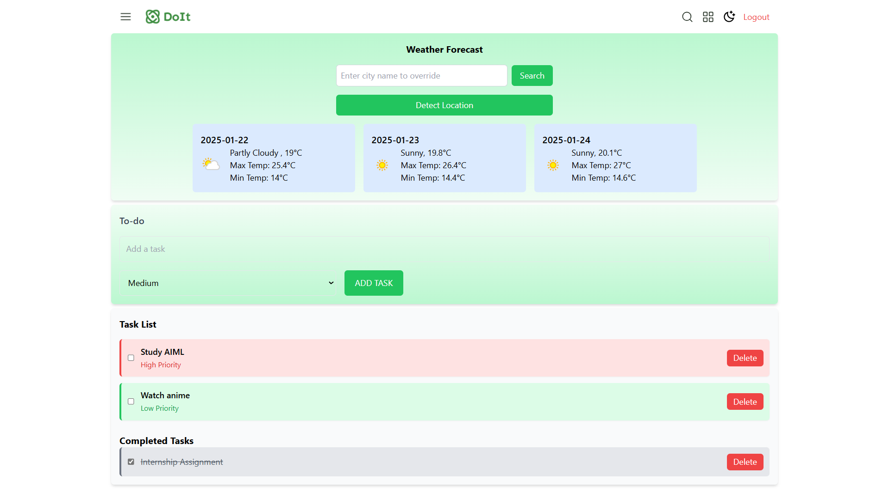
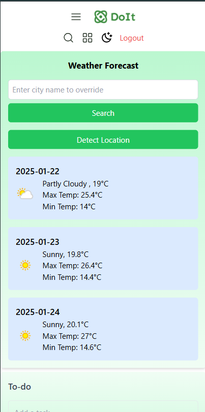
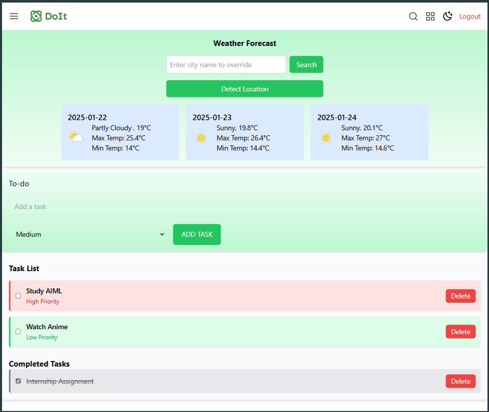
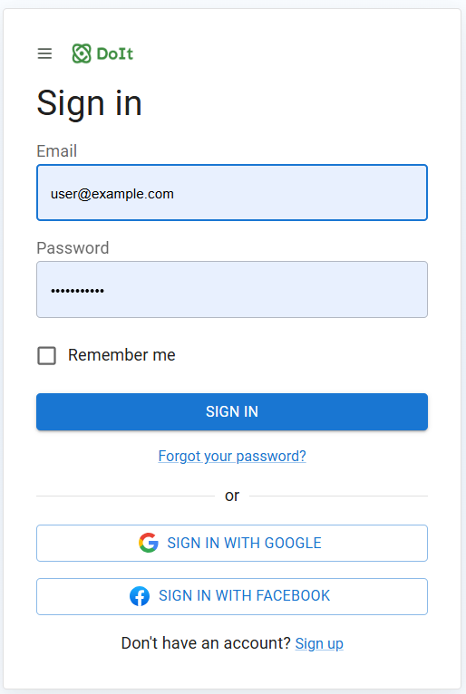

# **Advanced React To-Do Application with Weather Forecast**

## **Overview**

This project is an advanced To-Do application that incorporates modern features such as task prioritization, weather forecasting, and responsive design. Built with React and Redux Toolkit, it demonstrates state-of-the-art practices in frontend development.

---

## **Screenshots**

1. **Desktop View**  

2. **Smartphone View**    

3. **Tablet View**  

4. **SignIn Page**  

---

### **Features**

1. **Add Tasks**  
   Users can add tasks through a simple input field and assign a priority (High, Medium, Low).

2. **Delete Tasks**  
   Each task can be deleted individually, with immediate updates in the UI.

3. **View Tasks**  
   Active and completed tasks are displayed separately, with persistent storage across sessions.

4. **Task Prioritization**  
   Assign priorities to tasks and sort them from highest to lowest priority.

5. **Weather Widget**  
   - Automatically detects the user's location (if permissions are granted) and displays a 3-day weather forecast.
   - Includes a search bar for weather updates in other cities.

6. **Responsive Design**  
   Fully optimized for mobile, tablet, laptop, and desktop devices using a mobile-first design approach.

7. **State Management with Redux**  
   Used Redux Toolkit for global state management and implemented Redux Thunk for handling asynchronous operations such as API calls.

8. **Persistent Storage**  
   Tasks and authentication state are stored in localStorage for data retention across browser sessions.

9. **Mock Authentication System**  
   A simple login/logout functionality to protect the To-Do list, ensuring tasks are visible only to authenticated users.

---

### **Tech Stack**
- **Frontend**: React, Redux Toolkit, Redux Thunk, Tailwind CSS
- **API Integration**: Weather API ([weatherapi.com](https://www.weatherapi.com/))
- **Persistent Storage**: LocalStorage

---

### **Setup Instructions**

1. **Prerequisites**
   - Node.js (v16 or later) and npm installed.
   - A Weather API key from WeatherAPI.

2. **Clone the Repository**
git clone  
https://github.com/abhijit2607/Advanced-React-To-do-App   
cd advanced-react-todo-app

3. **Create React App**
If the repository does not include pre-initialized React files, initialize a new React app:  
npx create-react-app

4. **Install Dependencies**  
npm install

5. **Update API Key**  
Update the API key in the services/api.js file

6. **Start the Development Server**  
npm start

The application will run at [http://localhost:3000](http://localhost:3000).

---

### **Running Tests**
To run tests (if applicable), use the following command:  
npm test

---

### **Features Breakdown**

#### To-Do Features
- Add new tasks via an input field with priority selection.
- Delete tasks directly from the task list.
- View active and completed tasks in separate sections.
- Persistent storage ensures tasks remain saved across sessions.

#### Weather Widget
- Automatically detects the user's location and fetches a 3-day weather forecast.
- Users can search for the weather in other cities.
- Displays temperature, weather conditions, and city details.

#### Responsive Design
- Fully responsive layout using Tailwind CSS, with a mobile-first approach.
- Optimized for all device sizes (mobile, tablet, laptop, desktop).

#### State Management
- Redux Toolkit manages application state.
- Redux Thunk handles asynchronous actions like API calls for weather data.

#### Authentication
- Mock login/logout system implemented using Redux.
- Protects the To-Do list, ensuring only authenticated users can access tasks.

---

### **Usage**

#### Tasks
- Add, delete, and prioritize tasks.
- Toggle between active and completed tasks.

#### Weather Widget
- View the weather forecast for your location or any city.

#### Authentication
- Login to access and manage tasks. Logout to secure your session.

---
> **Note:** Credentials for mock authentication:  
Email= user@example.com  
password= password123

---